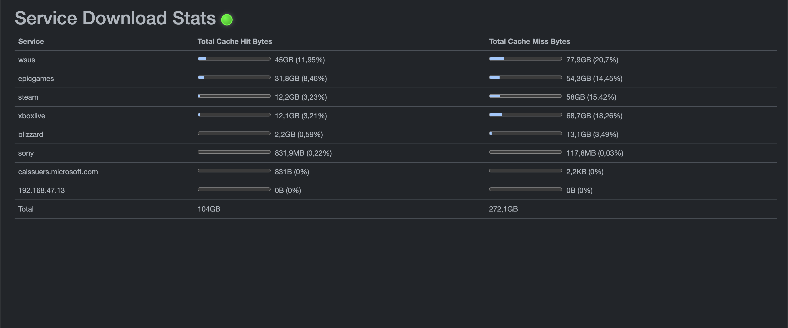

# DeveLanCacheUI_Frontend_Shrinked
This is a fork of unterlying DeveLanCacheUI_Frontend.

I have shrinked the Frontend to only Display the Service Download stats.
In my case to use it for digital signage integration.
I am only altering the frontend and running it on a different port.

Added this to my docker compose, in parallel to the existing installation:

  develancacheui_frontend_servicestats:
    build:
      context: https://github.com/Kev98710/DeveLanCacheUI_Frontend_shrinked.git#master
      dockerfile: DeveLanCacheUI_Frontend/Dockerfile
    restart: unless-stopped
    ports:
      - '7303:80'
    environment:
      - BACKENDURL=http://backend_ip_addr:7301 #iclude http/https here
      - AllowedHosts=*

## Related projects

| Project | Explanation |
| -- | -- |
| [DeveLanCacheUI_Backend](https://github.com/devedse/DeveLanCacheUI_Backend/) | The main project. Contains the readme. |
| [DeveLanCacheUI_Frontend](https://github.com/devedse/DeveLanCacheUI_Frontend/) | The Frontend. |
| [DeveLanCacheUI_SteamDepotFinder](https://github.com/devedse/DeveLanCacheUI_SteamDepotFinder) | A tool to generate the mapping for steam depots and games. Kinda deprecated when `Feature_DirectSteamIntegration` is set to true |
| [DeveLanCacheUI_SteamDepotFinder_Runner](https://github.com/devedse/DeveLanCacheUI_SteamDepotFinder_Runner) | Runs the SteamDepotFinder on a weekly basis. |

